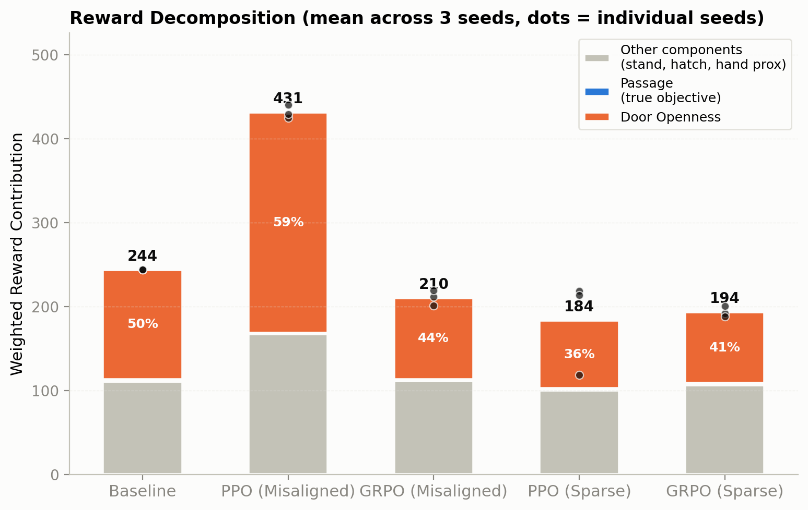
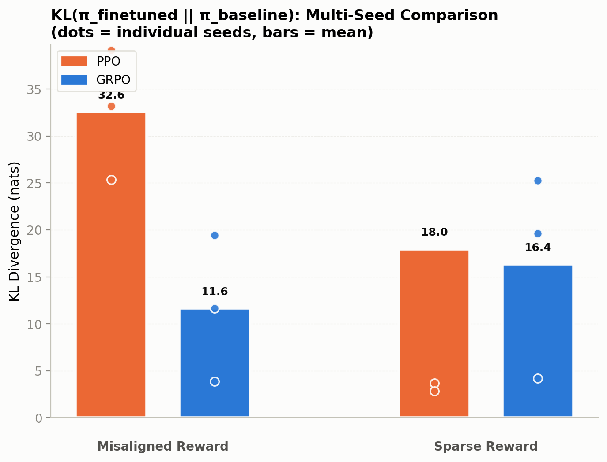
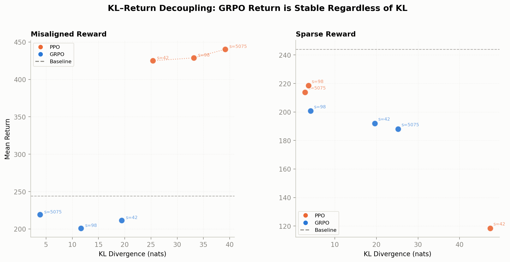
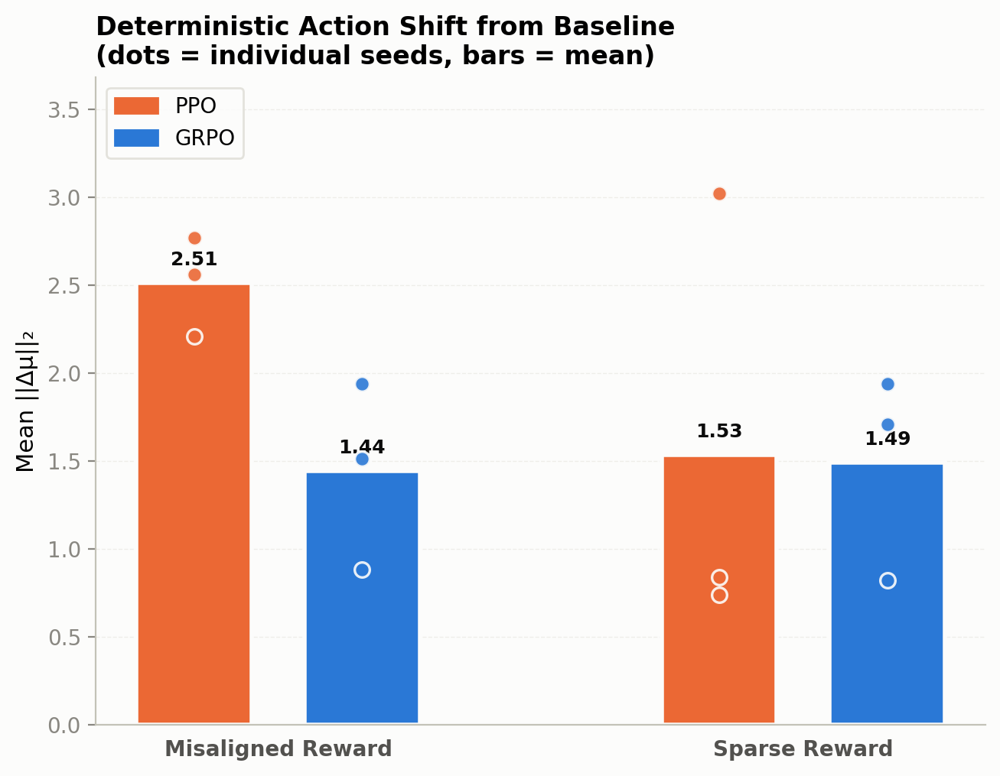
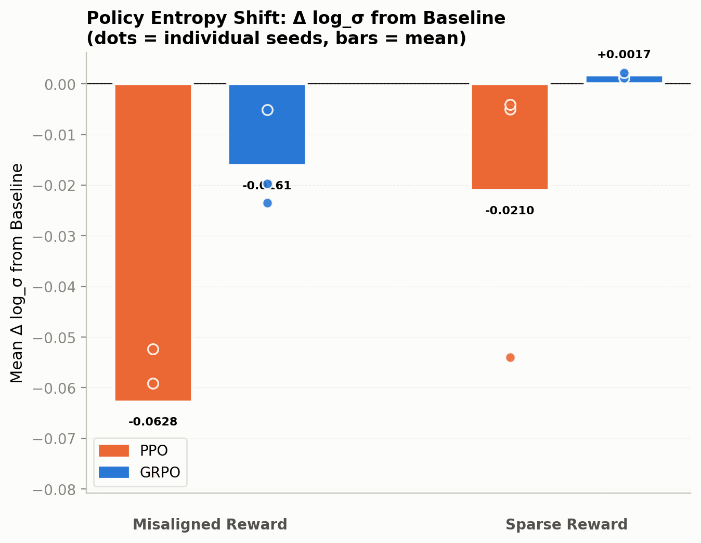
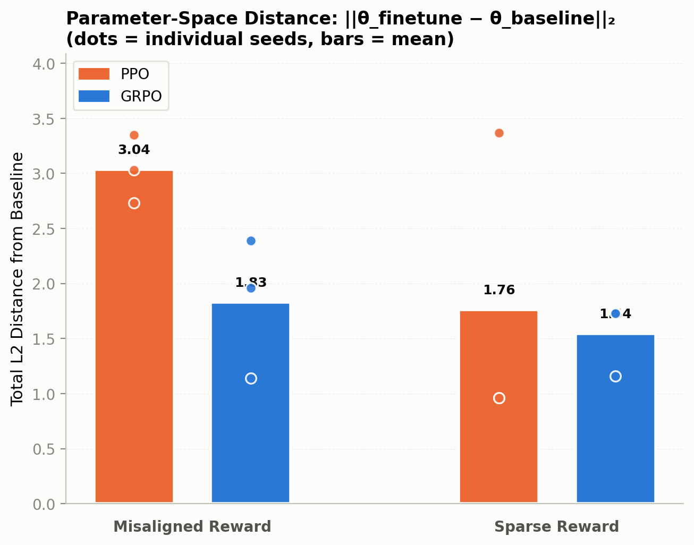
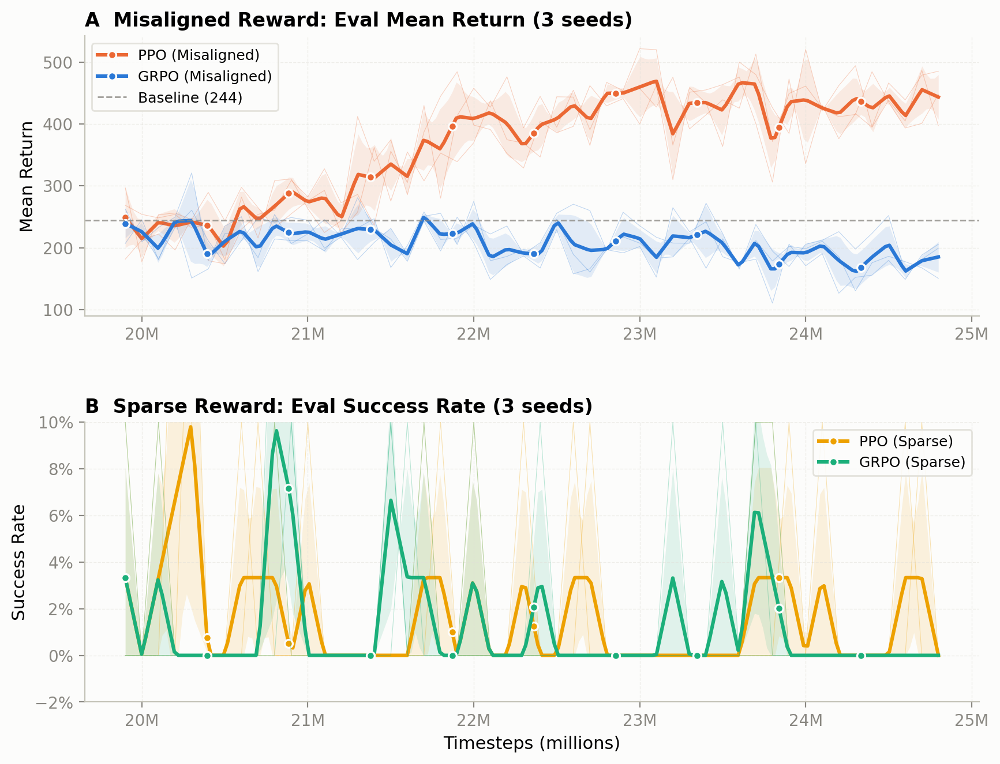

# 稀疏奖励环境下 PPO 与 GRPO 的策略鲁棒性研究

## 摘要

奖励信号的不可靠性是深度强化学习在现实应用中面临的核心挑战之一。在 sim2real 微调与长程机器人操作等场景中，奖励信号往往要么极度稀疏、仅在任务完成时给出，要么与真实目标不完全对齐，无法可靠地指向正确行为。本文在 HumanoidBench 的 Door 任务上系统对比了使用 GAE 绝对优势估计的 PPO 与使用组内相对优势估计的 GRPO 在两种奖励条件下的微调表现：Misaligned Reward 条件模拟奖励信息不可靠，Sparse Reward 条件模拟奖励极度稀疏。

实验结果表明，在 Misaligned 条件下 PPO 的 return 从基线 244 飙升至 431，成功率却从 5.0% 降至 0.0%，呈现系统性的 reward hacking；在 Sparse 条件下 PPO 则崩溃或停滞。相比之下，GRPO 在两种条件下均保持稳定，return 稳定在 188–219 的窄带内。KL 散度与参数空间距离分析显示，GRPO 的策略更新并非停滞，但其 return 与 KL 解耦：更新幅度可因种子和条件而异，return 却稳定不漂移，而 PPO 的 KL 与 return 高度耦合。这表明 GRPO 的更新幅度对奖励信号的尺度和密度不敏感，其 group-relative advantage 机制可能天然抑制 reward hacking 的正反馈循环，使 GRPO 成为奖励设计不完美或奖励极度稀疏场景下更安全的微调策略。

---

## 1. 引言

深度强化学习在机器人控制任务中取得了显著进展，但其成功高度依赖于奖励函数的质量。在现实应用中，设计一个既能引导学习、又与真实目标完全对齐的奖励函数极其困难[32]：基于 RL 的微调中，奖励信号往往要么过于稀疏，仅在任务完成时给出反馈[9]，长程操作任务中尤其如此，中间步骤缺乏明确的奖励引导[11,12]；要么与真实任务目标不完全对齐，包含误导性的 shaping 成分[23]。这两种情形的共同特征是，奖励信号不能可靠地指向正确行为：即便奖励在数值上稠密，shaping reward 与真实目标之间的不一致性本身也是一种信息不可靠，奖励值高不代表任务在朝正确方向进展。

与此同时，预训练-微调正成为机器人策略构建的重要范式[1]，先在大规模数据上预训练、再在目标任务上微调以适配特定本体与任务，基于 RL 的微调是其中的关键一环。PPO[2] 是目前最广泛使用的 on-policy RL 算法，也常被用作微调的默认选择，其优势估计依赖 GAE[3]（广义优势估计）：如果一个 shaping 成分能够持续提高 return，即使它与最终任务目标不一致，也可能产生持续的优化压力。因此，当微调阶段的奖励条件偏离真实目标时，PPO 的优化方向可能被误导性的奖励成分牵引。

近年来，GRPO 作为替代方案在 LLM 的强化学习微调中被广泛采用并取得显著成功[4]。与 PPO 将奖励提升本身作为优化依据不同，GRPO 改变了奖励的比较方式，从绝对改善转向组内相对改善：当一个奖励成分在一组样本中普遍提高时，组内标准化会削弱其作为区分性信号的作用，因此 GRPO 可能降低对系统性奖励膨胀的敏感性[19]。在机器人微调中，奖励提升未必意味着任务进展，这一差异使得 GRPO 可能对与任务目标不一致的系统性奖励增长更不敏感。然而，GRPO 在机器人领域的应用仍处于起步阶段，尚缺乏与 PPO 在奖励不可靠条件下微调表现的系统性对比。

为填补这一空白，本文通过 HumanoidBench[14] 的 Door 任务，系统对比了 PPO 与 GRPO 在两种奖励条件下的微调表现：Misaligned Reward 条件模拟奖励信息不可靠的场景，Sparse Reward 条件模拟奖励极度稀疏的场景。实验发现，PPO 在奖励不可靠时会发生系统性的 reward hacking，在奖励稀疏时则崩溃或停滞；而 GRPO 在两种条件下均保持稳定，其策略更新幅度可以因种子和条件而异，但 return 始终稳定。诊断分析表明，这一稳定性源于 group-relative advantage 的归一化效应，KL 惩罚消融与跨任务验证进一步确认了该机制的来源与泛化性。主要贡献包括：

1. 揭示了 PPO 在奖励不可靠场景下的 reward hacking 实证表现。在 Misaligned 条件下 PPO 的 return 从基线 244 飙升至 431，成功率却从 5.0% 降至 0.0%；在 Sparse 条件下则崩溃或停滞，失效模式随奖励条件切换。
2. 证明了 GRPO 在两种奖励条件下的稳定性及其 KL-return 解耦特征。GRPO 的 return 在所有种子下均稳定在 188–219 的窄带内，其策略更新幅度可以因种子和奖励条件而异，但 return 与 KL 解耦，不随更新幅度漂移。
3. 通过奖励分解与 KL 惩罚消融诊断了稳定性的机制来源。逐成分奖励分解表明 PPO 的回报增益集中于与成功弱相关的成分；KL 惩罚消融排除了"稳定性来自 KL 惩罚缺失"的替代解释，将稳定性归因于 group-relative advantage 的归一化效应。
4. 提供了跨任务证据与实践参考。Reach 任务上的附加实验表明结论不限于 Door 任务；在奖励设计不完美或奖励极度稀疏的场景中，GRPO 是比 PPO 更稳健的微调选择，且模型选择应同时监测 reward 成分分解与成功率，而非只看 return 涨幅。

---

## 2. 相关工作

错配奖励与 reward hacking。强化学习的目标由奖励函数设定，然而现实任务中奖励函数往往无法完美刻画真实目标，只能作为真实目标的不完美代理，过度优化这种 imperfect proxy 反而会损害真实目标上的性能[23]。当奖励设计与真实目标不完全对齐时，智能体可能系统性地利用奖励函数中的漏洞，优化代理指标而非真实目标，这一现象被称为 reward hacking[5]，Skalse 等[31] 给出了其形式化定义：优化 imperfect proxy 会在真实奖励上造成性能损失。Everitt 等[6] 最早将这类问题形式化为 Corrupt Reward MDP，指出奖励信号可能因传感器误差等原因被破坏，且传统 RL 方法难以补偿。Pan 等[7] 在四个错配奖励环境中的系统实验表明，更强的智能体更易利用错配奖励，且存在能力超过阈值后真实奖励骤降的相变现象。随着模型规模扩大，reward hacking 在 LLM 与多模态模型中同样普遍，Wang 等[8] 的综述将其统一解释为高维目标被压缩的奖励表征所驱动。在连续控制与机器人操作任务中，reward shaping 的每个成分都可能成为被利用的目标，如何评估与缓解 reward hacking 是安全强化学习的重要问题。

稀疏奖励下的长时序任务。当奖励信号仅在任务最终完成时给出，智能体在绝大多数时间步得不到任何学习信号，这一设定称为 sparse reward[9]。它带来两方面的困难：探索效率极低，随机探索几乎无法触及成功状态[11]；信用分配困难，即使偶然成功，也难以判断是哪些早期决策导致了成功[12]。当任务进一步具有 long-horizon 与多阶段结构时，这两个困难被显著放大[11,12]。机器人领域因此出现了多种恢复学习信号的方法，如事后经验重放[9]、演示数据引导[10]、利用现成基元控制器[11]、动作分块配合内在奖励[12]、课程学习[29]、好奇心驱动[13,28]以及分层结构[30]等。

预训练-微调与机器人 RL 后训练。在这一范式中，RL 后训练（post-training）是微调环节的关键手段：视觉-语言-动作基础模型如 GR00T N1[15]、Ψ₀[16] 以 RL 后训练适配具体本体；纯 RL 预训练策略同样依赖微调适应新环境，如 SAC 大规模预训练后以 model-based 方法微调[24]、transformer 序列建模预训练后以 RL 微调适应非平坦地形[25]；Robot Trains Robot[17] 则在真实世界中利用机械臂教师辅助人形机器人学生进行微调。Gu 等[26] 的综述系统梳理了这些 learning-based 方法在人形运动与操作中的进展。这类工作通常在各自收集的数据与 benchmark 上评估，缺乏一个统一的人形机器人环境来系统考察微调阶段的行为。HumanoidBench[14] 为这一范式提供了标准化的评估环境，本文使用的 Door 任务即来自该基准。在这些范式中，预训练策略在目标环境上的微调是常见做法，但微调阶段的奖励条件可能偏离预训练阶段，这种偏离对策略稳定性的影响尚缺乏系统研究。

GRPO 及其在不可靠奖励下的表现。GRPO 最初在 LLM 的数学推理任务中被提出[4]，其基于群体的比较机制对奖励信号中的个体级噪声具有天然的鲁棒性，Noise-corrected GRPO[18] 从理论上分析了这一性质并提出噪声校正方法以进一步获得无偏梯度；Yao 等[19] 在多模态 RL 对齐实验中观察到 GRPO 是三种对比算法中最抗 reward hacking 的。在连续控制领域，Khanda 等[20] 提出了首个将 GRPO 扩展到连续控制的理论框架，包含轨迹聚类分组与状态感知优势估计等组件；de Oliveira 等[21] 在经典 RL 环境中观察到，在长时程连续控制任务上无 critic 的 GRPO 通常逊于 PPO，仅在短时程环境中例外，说明 GRPO 的优势并非普适；Doorman[22] 则将 GRPO 应用于人形机器人 Door 任务的 sim-to-real 微调，以缓解仅二值成功信号下的部分可观测性问题。总体来看，现有工作主要关注 GRPO 能否用于连续控制或特定机器人场景，或对比 GRPO 与 PPO 直接用于从头训练时的表现；虽有工作注意到 GRPO 在微调场景中的应用，但缺少对 GRPO 在奖励不可靠和极度稀疏条件下与 PPO 相对行为的系统研究。本文针对这一问题对两种算法在微调场景中的相对表现进行系统比较，并进一步分析 group-relative advantage 与策略更新稳定性之间的关系。

## 3. 方法

### 3.1 问题形式化

考虑标准的强化学习框架，其中智能体在环境中执行动作 $a_t \sim \pi_\theta(\cdot | s_t)$，接收奖励 $r_t$，并最大化累积折扣回报 $\mathbb{E}[\sum_{t} \gamma^t r_t]$。在策略微调场景中，我们从预训练策略 $\pi_0$ 出发，在目标环境上继续优化，目标环境的奖励函数 $\hat{R}$ 可能与训练时使用的奖励函数 $R$ 不同。

我们关注两种具有实际意义的奖励条件：

- Misaligned Reward：$\hat{R}$ 是多个成分的加权和，其中部分成分与真实成功条件不完全对齐。奖励在每步均有非零值，但其数值大小不一定反映任务进展。
- Sparse Reward：训练阶段 $\hat{R}$ 仅在 trajectory 终止时给出二值信号，成功为 1 否则为 0。奖励与目标完全对齐，但信息量极少。两种条件仅在训练奖励上不同，评估阶段统一使用原始完整加权奖励，以保证不同条件下的 return 可比。

### 3.2 算法

PPO (Proximal Policy Optimization)。PPO 使用 GAE 估计优势函数：

$$\hat{A}_t^{\text{GAE}} = \sum_{l=0}^{\infty} (\gamma\lambda)^l \delta_{t+l}, \quad \delta_t = r_t + \gamma V(s_{t+1}) - V(s_t)$$

其中 $\delta_t$ 是 TD 误差，$\lambda$ 控制偏差-方差权衡。GAE 的优势值直接依赖于奖励的绝对大小：任何使 $\delta_t > 0$ 的行为都产生正的学习信号。

GRPO (Group Relative Policy Optimization)。本文遵循 Doorman[22] 的 trajectory-level 设计，使用组内相对优势进行人形机器人策略微调。受限于单 GPU 显存，本文使用 $K = 4$ 个并行环境，每个环境独立采样一条 rollout 构成一个 group，获得折扣回报 $\{G_1, \ldots, G_K\}$，组内均值为 $\bar{G} = \frac{1}{K}\sum_k G_k$。GRPO 的优势函数为：

$$\hat{A}_k^{\text{GRPO}} = \frac{G_k - \bar{G}}{\sigma_G + \epsilon}$$

其中 $\sigma_G$ 是组内回报的标准差。该优势函数随后被送入 PPO 的标准 clipped objective：

$$\mathcal{L}^{\text{GRPO}} = \mathbb{E}\left[\min\left(\rho_k \hat{A}_k^{\text{GRPO}}, \operatorname{clip}(\rho_k, 1-\epsilon, 1+\epsilon)\hat{A}_k^{\text{GRPO}}\right)\right]$$

其中 $\rho_k = \frac{\pi_\theta(a|s)}{\pi_{\text{old}}(a|s)}$ 是重要性采样比率。与原始 LLM 版 GRPO 不同，本实现不使用 KL 惩罚项 $\beta D_{\text{KL}}(\pi_\theta \parallel \pi_{\text{ref}})$，trust region 仅由 PPO 的 clipping 机制提供。此外，GRPO 不使用价值函数（critic），优势信号完全由组内相对比较产生，无需学习绝对的价值估计，也避免了价值函数估计误差带来的额外信号噪声。

两种算法的关键差异在于优势信号的来源：PPO 的 GAE 基于绝对奖励值，任何奖励提升都被编码为正向优势；GRPO 的 group-relative advantage 基于组内相对表现，只有优于同组其他样本的行为才产生正优势。

### 3.3 实验设计

#### 3.3.1 环境

- 任务：HumanoidBench `h1hand-door-v0`，H1 人形机器人推开门并通过
- 观测：155 维向量，经 VecNormalize 归一化后输入策略
- 动作空间：61 维连续控制（对角高斯策略）
- 最大步长：1000 steps/episode
- 成功标准：机器人躯干 x 坐标 > 0.8，即越过位于 x = 0.8 m 处的门框

环境使用 MuJoCo 物理引擎，控制频率为 50 Hz（frame_skip = 10）。任务的难度在于机器人需要协调全身运动，先接近门并将手放在把手上按压，然后推开门并通过。

#### 3.3.2 奖励函数

Door 任务的原始奖励由 6 个原始信号构成 5 个加权项：

$$
R = \underbrace{0.1 \cdot R_\text{stand} \cdot R_\text{control}}_{\text{姿态维持}} + \underbrace{0.45 \cdot R_\text{door\_open}}_{\text{门开启角度}} + \underbrace{0.05 \cdot R_\text{hatch\_open}}_{\text{门把手按压幅度}} + \underbrace{0.05 \cdot R_\text{hand\_prox}}_{\text{手-把手距离}} + \underbrace{0.35 \cdot R_\text{passage}}_{\text{通过门框}}
$$

各成分的具体计算如下：
- $R_\text{stand}$：躯干高度 ≥ 1.65 m 且竖直程度 ≥ 0.9 时取 1，偏离时衰减，范围 $[0, 1]$；
- $R_\text{control} = (4 + \bar{c})/5$，其中 $\bar{c}$ 为关节力矩的区间奖励值，力矩越小越接近 1，因此 $R_\text{control} \in [0.8, 1]$；
- $R_\text{door\_open} = \min(1, q_d \cdot |q_d|)$，其中 $q_d$ 为门关节角度（rad），正向开启时退化为 $\min(1, q_d^2)$，$q_d = 1$ rad 时饱和为 1，且每步均可推拉门产生非零信号；
- $R_\text{hatch\_open}$：把手关节角度落在 $[0.75, 2]$ rad 内时取 1；
- $R_\text{hand\_prox}$：双手到门把手距离最小值不超过 0.25 m 时取 1；
- $R_\text{passage}$：躯干（imu site）x 坐标 ≥ 1.2 m 时取 1，$x$ 在 0.2–1.2 m 间线性上升，$x \leq 0.2$ m 时取 0。

#### 3.3.3 基线模型

基线模型使用 PPO 在 Door 任务上经课程学习预训练得到。课程学习包含四个阶段，逐步增加任务难度，训练过程中使用完整的 dense reward。基线模型的表现如下：

| 指标 | 值 |
|------|-----|
| 成功率 | 5.0% |
| 平均回报 | 244.0 |

注：Baseline 为单一预训练模型，表中数值为其 100 个评估 episode 的均值，无跨种子统计。

基线成功率较低，但已具备基本的任务结构认知，足以作为比较两种微调策略稳定性的共同起点。

#### 3.3.4 训练与评估设置

两种奖励条件从不同角度模拟了现实 RL 微调中的奖励难题，其定义见 §3.1，训练阶段使用的奖励与对应模型命名如下：

| 条件 | 训练奖励 | PPO 模型 | GRPO 模型 |
|------|---------|---------|----------|
| Misaligned Reward | 原始 Dense Reward（5 个加权项） | PPO (Misaligned) | GRPO (Misaligned) |
| Sparse Reward | 二值奖励（Success=1, else 0） | PPO (Sparse) | GRPO (Sparse) |

所有模型从基线的权重初始化，学习率 3e-5，4 并行环境，训练 5M steps。模型选择标准为：在训练过程中的周期评估中，分别选取 Misaligned Reward 条件下 mean reward 最高和 Sparse Reward 条件下 mean reward 最高的 checkpoint。所有实验在 3 个独立训练种子（42, 98, 5075）上重复，以验证结论的统计稳健性。

评估使用 5 个独立种子（1024, 2024, 777, 88, 13），每个种子运行 20 episodes，总计 100 episodes per model。所有推理使用确定性策略（`deterministic=True`）。主要评估指标包括成功率和 episode return。

#### 3.3.5 评估与分析协议

评估指标计算。成功率定义为 100 个评估 episode 中成功通过门框的 episode 比例，成功标准见 §3.3.1；episode return 为单条 episode 的累积加权奖励。

奖励分解。我们在环境 wrapper 中捕获每个 step 的 `info` dict 中的各 reward 成分，在 episode 结束时输出各成分的累积值。对于姿态维持成分（$0.1 \cdot R_\text{stand} \cdot R_\text{control}$），由于 $\sum (a_t \cdot b_t) \neq (\sum a_t) \cdot (\sum b_t)$，我们采用逐步累加乘积的方式计算，而非对 episode 求和后再相乘。

KL 散度与策略分析。我们使用基线策略在环境中 rollout 收集 1000 个原始观测。对于每个微调模型，使用各自的 VecNormalize 统计量对观测进行归一化，然后提取动作分布参数 $(\mu, \log\sigma)$。对于两个 $d$ 维对角线高斯分布 $P$ 和 $Q$，KL 散度的闭式解为：

$$D_{\text{KL}}(P \parallel Q) = \sum_{i=1}^{d} \left[ \log\frac{\sigma_{Q,i}}{\sigma_{P,i}} + \frac{\sigma_{P,i}^2 + (\mu_{P,i} - \mu_{Q,i})^2}{2\sigma_{Q,i}^2} - \frac{1}{2} \right]$$

我们分别计算 $D_{\text{KL}}(\pi_\text{finetuned} \parallel \pi_\text{baseline})$ 在每个观测上的值，并报告其均值、中位数、标准差和分位数。参数空间距离直接在模型权重上计算逐层 L2 范数 $||\theta_\text{finetuned} - \theta_\text{baseline}||_2$。

---

## 4. 实验结果

### 4.1 主要结果：两种奖励条件下的整体表现

| 指标 | Baseline | PPO (Misaligned) | GRPO (Misaligned) | PPO (Sparse) | GRPO (Sparse) |
|------|----------|------------------|-------------------|-------------|---------------|
| 成功率 | 5.0% | 0.0% ± 0.0% | 1.3% ± 1.2% | 0.3% ± 0.6% | 1.3% ± 1.5% |
| 平均回报 | 244.0 | 431.4 ± 8.0 | 210.5 ± 9.1 | 183.6 ± 56.5 | 193.6 ± 6.5 |

表中 PPO/GRPO 数据为 3 个训练种子（42, 98, 5075）的跨种子均值 ± 跨种子标准差，每个种子评估 100 episodes；Baseline 为单一预训练模型，表中数值为其 100 个评估 episode 的均值。

**Misaligned Reward 条件**。PPO 的 return 在全部 3 个种子下均飙升至 431，较 baseline 提升 77%，成功率却一致降至 0%，回报上升与任务完成完全脱钩，这是 reward hacking 的定义性特征：PPO 学到的是最大化回报而非完成任务的策略。GRPO 的 return 则稳定在 211，较 baseline 仅下降 13%，未对这一不可靠的奖励信号产生过度响应。

**Sparse Reward 条件**。移除 dense reward 后，PPO 的行为随训练种子剧烈分化：种子 42 的 return 崩溃至 118，较 baseline 下降 52%，种子 98 和 5075 则勉强维持在 214–219，跨种子 std 高达 56.5。其行为由训练随机性主导而非任务结构，说明 PPO 在稀疏奖励下无法获得稳定的学习信号。GRPO 的 return 在所有种子下均稳定在 188–201，跨种子均值 194，未出现 PPO 那样的崩溃或种子分化，保持了稳定的表现。

跨条件对比显示，PPO 的 return 从 Misaligned 的 431 跌至 Sparse 的 184，而 GRPO 仅从 211 微降至 194。这一差异的关键含义在于，GRPO 在 Misaligned 条件下并未被锁死在 reward hacking 行为中，因此切换奖励结构时无需恢复；而 PPO 的失效模式随条件切换：奖励误导时 hacking，奖励稀疏时崩溃或停滞。三种子与两种条件相互印证，说明这些差异是算法机制层面的系统行为，而非个别种子的偶然结果。

从最差种子（worst-case）的视角看，这一差异同样显著：PPO 在 Sparse 条件下的最低 return 为 118.4，较 baseline 下降 52%，GRPO 的最低 return 为 188.1，仅下降 23%；Misaligned 条件下 GRPO 各种子 return 均不低于 200.9，而 PPO 虽然 return 高，三种子的成功率却全部为 0%。就微调后表现的最坏下界而言，GRPO 显著优于 PPO，这是其作为更安全微调选项的直接依据。

为了排除 checkpoint 选择指标对结论的影响，我们追加了一组以 success rate 而非 mean reward 为模型选择标准的实验，其余设置与 §3.3 完全一致。主要结果如下：

| 指标 | Baseline | PPO (Misaligned) | GRPO (Misaligned) | PPO (Sparse) | GRPO (Sparse) |
|------|----------|------------------|-------------------|-------------|---------------|
| 成功率 | 5.0% | 0.7% ± 0.6% | 1.7% ± 2.1% | 0.3% ± 0.6% | 1.3% ± 1.5% |
| 平均回报 | 244.0 | 431.2 ± 38.8 | 191.4 ± 28.9 | 183.6 ± 56.5 | 193.6 ± 6.5 |

表中数据为 3 个训练种子的跨种子均值 ± 跨种子标准差；Baseline 为单一预训练模型。

在 Sparse Reward 条件下，以 success rate 与 mean reward 选择的 checkpoint 结果完全一致，这是二值奖励下两种指标等价的直接结果。在 Misaligned Reward 条件下，即便改以 success rate 为标准，PPO 的 return 依然高达 431，seed 42 的 checkpoint 甚至达到 476，而成功率仅为 0.7%，与按 mean reward 选择时的低成功率模式一致。这说明 reward hacking 是 PPO 优化过程的系统性结果，而非 checkpoint 选择指标所致。GRPO 在 by-success 选择下的 return 为 191，成功率 1.7%，仍保持在 baseline 附近且未出现 reward hacking。总体而言，主要结论对 checkpoint 选择指标保持稳健：PPO 的 reward hacking 与 Sparse 条件下的不稳定性、GRPO 的保守稳定，均不依赖于模型选择方式。

### 4.2 诊断分析

主要结果已经表明，PPO 在奖励不可靠时发生了 reward hacking，而 GRPO 保持稳定。本节通过奖励分解、KL 散度和参数空间距离三个维度的诊断分析，进一步定位这两种行为差异的来源：

#### 4.2.1 奖励分解

图 1：各模型在 Door 任务上的 reward 分解堆叠柱状图，柱高为各加权成分的累积值；橙色为门开启角度，蓝色为通过门框，灰色为其余成分。

各模型加权贡献对比（跨 3 种子均值 ± 跨种子 std）：

| 成分（权重） | Baseline | PPO (Misaligned) | GRPO (Misaligned) | PPO (Sparse) | GRPO (Sparse) |
|-------------|----------|------------------|-------------------|-------------|---------------|
| 姿态维持 (0.1) | 61.6 ± 0.0 | 84.4 ± 1.3 | 61.3 ± 2.5 | 56.5 ± 3.8 | 59.0 ± 6.6 |
| 门开启角度 (0.45) | 131.1 ± 0.0 | 263.4 ± 8.1 | 97.4 ± 8.4 | 81.2 ± 47.3 | 85.3 ± 16.7 |
| 门把手按压幅度 (0.05) | 17.7 ± 0.0 | 39.2 ± 0.4 | 18.2 ± 0.6 | 15.4 ± 4.0 | 17.5 ± 1.2 |
| 手-把手距离 (0.05) | 32.0 ± 0.0 | 44.1 ± 0.5 | 31.8 ± 1.1 | 28.2 ± 4.2 | 30.4 ± 3.6 |
| 通过门框 (0.35) | 1.7 ± 0.0 | 0.2 ± 0.1 | 1.8 ± 1.4 | 2.3 ± 2.5 | 1.4 ± 0.6 |

奖励构成占比变化（跨种子均值）：

| 成分 | Baseline | PPO (Misaligned) | GRPO (Misaligned) | PPO (Sparse) | GRPO (Sparse) |
|------|----------|------------------|-------------------|-------------|---------------|
| 姿态维持 | 27.1% | 21.1% | 30.3% | 37.0% | 31.8% |
| 门开启角度 | 49.8% | 58.5% | 43.7% | 35.9% | 41.1% |
| 门把手按压幅度 | 8.4% | 9.4% | 9.4% | 8.8% | 10.0% |
| 手-把手距离 | 14.2% | 10.9% | 15.7% | 16.7% | 16.4% |
| 通过门框 | 0.4% | 0.1% | 0.9% | 1.6% | 0.7% |

在 Misaligned Reward 条件下，PPO 相比 Baseline 的总奖励增量为 +187（跨种子均值），其中门开启角度奖励增量为 +294（未加权），而通过门框奖励变化为 -4.1；门开启角度占比相应从 49.8% 升至 58.5%，通过门框占比从 0.4% 降至 0.1%。这说明 PPO 的回报增益大部分来自操纵门角度，真正反映任务完成的通过门框奖励反而下降，回报增长与任务目标脱钩，是 reward hacking 的典型特征。值得注意的是，这种放大并非局限于门开启角度：姿态维持从 61.6 升至 84.4、把手按压从 17.7 升至 39.2，同样显著上升，仅通过门框成分下降。这说明 PPO 的 hacking 倾向是普适的，凡每步可得、与成功条件弱相关的成分都会被放大；其中门开启角度的放大最为突出，因为其权重 0.45 为全部成分最高，且门可反复开合、该奖励每步非零、梯度信号密集，在同样易得的条件下提供最大的回报增量；而通过门框奖励在绝大多数轨迹中接近零，难以提供有效梯度。该行为在所有种子下均稳定出现，PPO 的 door_openness 跨种子 std 仅 8.1。相比之下，GRPO (Misaligned) 的门开启角度占比 43.7% 甚至低于 Baseline，说明其不仅没有放大该成分，反而相对抑制了它；Sparse 条件下两模型的占比同样低于 Baseline，PPO 为 35.9%、GRPO 为 41.1%，未出现对单一 reward 成分的过度依赖。这也说明是否发生 reward hacking 取决于算法机制，而非奖励的权重结构本身。

#### 4.2.2 KL 散度与策略变化量

图 2：各模型相对 Baseline 的动作分布 KL 散度，跨 3 种子；柱高为跨种子均值，散点为单个种子。

在同 1000 个由 baseline 策略收集的固定观测上，分别计算各模型的动作分布相对于 Baseline 的 KL 散度，采用对角线高斯闭式解。下表为跨 3 种子的均值 ± 跨种子 std：

| 模型 | Mean KL (nats) | Per-dim (nats/dim) | 各训练种子 |
|------|---------------|--------------------|------------|
| PPO (Misaligned) | 32.6 ± 6.9 | 0.53 | 25.4, 33.2, 39.2 |
| GRPO (Misaligned) | 11.6 ± 7.8 | 0.19 | 19.4, 11.7, 3.8 |
| PPO (Sparse) | 18.0 ± 25.5 | 0.29 | 47.4, 3.7, 2.8 |
| GRPO (Sparse) | 16.4 ± 10.9 | 0.27 | 19.6, 4.2, 25.2 |

更新幅度方面，所有微调模型相对 Baseline 的 KL 均显著大于零，最低为 2.8 nats，按 61 维动作空间折算平均每维约 0.05 nats，说明两类策略都发生了实质性更新，GRPO 的稳定并非源于策略停滞。Misaligned 条件下，PPO 的更新幅度 32.6 nats、平均每维 0.53，约为 GRPO 的 11.6 nats、平均每维 0.19 的 3 倍，且三种子一致处于 25.4–39.2 的高位，与其 reward hacking 行为对应；GRPO 的更新幅度在 3.8–19.4 之间因种子而异，但该变异未转化为 return 的波动，体现 KL-return 解耦。Sparse 条件下，PPO 的更新幅度跨种子严重分化：seed 42 的 KL 爆炸至 47.4 并伴随 return 崩溃，seed 98/5075 的 KL 坍缩至 2.8–3.7 并伴随策略停滞；GRPO 的 KL 保持 4.2–25.2，未出现坍缩。因此，跨种子与跨条件一致地观察到：GRPO 的更新幅度可变但 return 稳定，PPO 的更新幅度与 return 高度耦合且失效模式随条件切换。

图 3：KL 散度与 return 的散点图，双面板，左为 Misaligned Reward 条件、右为 Sparse Reward 条件；虚线为 Baseline 参考线。

图 3 展示了 GRPO 的 KL-return 解耦特征：在两种条件下，GRPO 的散点都聚集在 return ≈ 200 的水平带内，KL 从 3.8 到 25.2 不等而 return 不变；PPO 则相反，Misaligned 条件下其 KL 与 return 同步升高，Sparse 条件下呈两极分化，高 KL 对应崩溃、低 KL 对应停滞。这一对比表明，GRPO 的策略更新幅度可以因种子和条件而异，但更新方向始终与任务目标一致而不 reward hack；PPO 的更新幅度和方向同时受 reward 信号驱动，在不可靠奖励下容易失控。定量地看，Sparse 条件下 PPO 的 KL 跨种子带宽 44.6 nats 对应 return 带宽 100.1，而 GRPO 的 KL 带宽 21.0 nats 仅对应 return 带宽 12.6，更新幅度的种子间差异几乎不传导为 GRPO 的表现差异，却显著传导为 PPO 的表现差异。

图 4：各模型确定性动作均值相对 Baseline 的 L2 距离，跨 3 种子均值，散点为单个种子。

PPO (Sparse) 的动作偏移跨种子 std 达 1.30，远高于其余配置；GRPO 在两种条件下的动作偏移均值分别为 1.44 和 1.49，几乎一致。

图 5：各模型相对 Baseline 的 log_σ 平均偏移，跨 3 种子均值，散点为单个种子。

PPO (Misaligned) 在所有种子下一致降低 entropy，偏移 -0.05 至 -0.08，这是 reward hacking 策略的特征之一：锁定在特定动作模式中，降低探索以维持高回报。PPO (Sparse) 的 log_σ 变化在种子间高度不一致，cross-seed std 为 0.028，与 return 的种子间波动一致。GRPO (Sparse) 在三个种子下 log_σ 几乎不变，偏移 +0.002 ± 0.001，保持了与 Baseline 相同的探索水平，这可能是 GRPO 在极度稀疏奖励下避免确定性崩溃的关键因素。

#### 4.2.3 参数空间距离

图 6：各模型相对 Baseline 的参数空间 L2 距离，跨 3 种子均值，散点为单个种子。

PPO (Sparse) 的参数距离跨种子 std 达 1.36，种子 42 的参数偏离 3.37 是种子 98/5075 的 1.09/0.96 的约 3 倍；GRPO 在两种条件下的参数距离均值分别为 1.83 和 1.43。该跨种子变异模式与动作分布 KL 一致，例如 GRPO (Misaligned) 的 KL std 7.8 对应参数距离 std 0.63，两种度量从不同层面反映相同的更新特征。

#### 4.2.4 VecNormalize 漂移

| 模型 | ‖Δ mean‖ (cross-seed) | ‖Δ var‖ (cross-seed) |
|------|----------------------|---------------------|
| PPO (Misaligned) | 0.24 ± 0.04 | 16.3 ± 3.5 |
| GRPO (Misaligned) | 0.19 ± 0.11 | 13.4 ± 8.3 |
| PPO (Sparse) | 0.24 ± 0.29 | 17.5 ± 22.1 |
| GRPO (Sparse) | 0.35 ± 0.18 | 24.3 ± 12.8 |

训练过程中 VecNormalize 的观测统计量会随策略分布变化而漂移，需确认其不构成对上述结论的替代解释。四种配置的漂移幅度总体相近，‖Δmean‖ 跨种子均值在 0.19–0.35、‖Δvar‖ 在 13–24 之间，仅 PPO (Sparse) 的跨种子离散度偏高，‖Δvar‖ 的 cross-seed std 达 22.1。漂移未呈现与 KL 或 return 差异相匹配的系统性模式，不改变 §4.2.2–4.2.3 的结论。

#### 4.2.5 小结

四种子的证据指向一致：PPO 在奖励不可靠时要么 reward hack，要么崩溃或停滞，且行为跨种子可复现；GRPO 则存在实质性的策略更新而 return 保持稳定，即 KL-return 解耦。动作分布、参数空间与探索水平等多个层面的度量相互印证，且这一对比不依赖于 checkpoint 选择指标。

### 4.3 消融实验：KL 惩罚的作用

标准 GRPO 在损失中加入相对 reference policy 的 KL 惩罚，而本文主实验的 GRPO 遵循 Doorman 的实现去掉了该惩罚项。为确认稳定性归因于 group-relative advantage 而非 KL 惩罚的缺失，我们补充了带 KL 惩罚的 GRPO 消融，KL 系数 β=0.01，其余设置与主实验完全一致，覆盖 3 个训练种子与两种奖励条件。结果如下表所示：

| 指标 | Baseline | GRPO | GRPO+KL | PPO |
|------|----------|------|---------|-----|
| Return (Misaligned) | 244.0 | 210.5 ± 9.1 | 222.4 ± 16.4 | 431.4 ± 8.0 |
| Return (Sparse) | 244.0 | 193.6 ± 6.5 | 217.9 ± 15.5 | 183.6 ± 56.5 |
| door 占比 (Misaligned) | 49.8% | 43.7% | 49.2% | 58.5% |
| door 占比 (Sparse) | 49.8% | 41.1% | 48.3% | 35.9% |
| 成功率 (Misaligned) | 5.0% | 1.3% ± 1.2% | 3.0% | 0.0% ± 0.0% |
| 成功率 (Sparse) | 5.0% | 1.3% ± 1.5% | 1.7% | 0.3% ± 0.6% |

带 KL 惩罚的 GRPO 在两种条件下均未出现 reward hacking：门开启角度占比 49.2%（Misaligned）与 48.3%（Sparse）与 baseline 的 49.8% 基本持平，而 PPO 的对应占比分别为 58.5% 与 35.9%；return 为 222 与 218，贴近 baseline 且不低于无 KL 版本（210 与 194）；成功率 3.0% 与 1.7%，也不弱于无 KL 版本。这说明无论是否带 KL 惩罚，GRPO 都不会放大单一 reward 成分，稳定性源于 group-relative advantage 机制本身。

KL 惩罚的实际作用是收紧更新幅度，而非决定是否 hack。带 KL 的 GRPO 相对 baseline 的 KL 为 3.5 nats、参数距离 1.33，均明显小于无 KL 版本的 11.6 nats 与 1.83，但仍显著大于零，平均每维 0.06 nats，说明其策略仍有实质更新而非停滞；其在 Sparse 条件下 return 反而更高（218 vs 194），未因 KL 约束而学不动。

### 4.4 跨任务验证：Reach 任务

为进一步验证上述结论的泛化性，我们在 HumanoidBench 的 Reach 任务（`h1hand-reach-v0`）上进行了附加实验。Reach 任务要求 H1 机器人的左手到达目标位置，采用与 Door 任务 Sparse 条件完全一致的稀疏二值成功奖励：episode 中间步骤奖励为 0，仅在 episode 结束时若手-目标距离 < 0.05 m 则给予 1.0。PPO 和 GRPO 均从相同的预训练 Reach 模型初始化，使用相同的超参数，单种子训练 2M steps。

Reach 任务的稀疏奖励比 Door 更极端：Door 的 reward 函数内部仍有 6 个成分的加权结构，其数值虽不与成功对齐，但提供了隐式的行为梯度；Reach 的 reward 仅含一个终端二值信号，中间步骤完全为零。结果如下表所示：

| 指标 | PPO (Sparse) | GRPO (Sparse) |
|------|-------------|---------------|
| 成功率 | 0.0% | 1.0% |
| Mean Return | 418.1 ± 320.9 | 712.6 ± 232.3 |

由于预训练 Reach 模型与微调模型的评估维度不匹配，无法直接量化微调相对预训练的成功率恢复程度，因此仅比较两种微调策略的相对表现：GRPO 的 return 均值更高，较 PPO 提升约 70%，方差更小，从 ±321 降至 ±232，且是唯一在 100 个评估 episode 中至少成功 1 次的模型。在纯稀疏、无任何中间引导的极端条件下，GRPO 的相对优势仍然可复现，这与 Door 任务上的结论一致。这一结果也揭示了 GRPO 鲁棒性的边界：当奖励信号完全缺乏中间状态的区分度时，group-relative advantage 的组内归一化可能退化为纯噪声，GRPO 也无法有效学习，但即便如此，其表现仍优于 PPO。

---

## 5. 讨论

### 5.1 对 GRPO 鲁棒性的可能机制解释

GRPO 的核心机制是组内相对优势（group-relative advantage）：对于同一初始状态的 K 个 rollout，优势函数计算的是个体相对于组内平均的相对表现，而非绝对奖励值。§4 的观察表明，GRPO 在两种奖励条件下均保持稳定，而 PPO 在 Misaligned 条件下 reward hack、在 Sparse 条件下崩溃或停滞。以下从机制层面解释这一差异。

在 Misaligned Reward 条件下，PPO 的 GAE 机制可能形成正反馈循环：策略偶然发现推拉门能提高门开启角度奖励，GAE 将其绝对提升编码为正向梯度信号；更新后的策略更擅长推拉门，奖励更高，梯度更强，行为进一步极端化。GRPO 的 group-relative 机制则可能打断这一循环：当一组 rollout 中大部分样本都获得高门开启角度奖励时，组内均值同步升高，个体相对优势接近于零，即使绝对奖励很高也不产生强烈梯度；只有真正优于同组其他样本的行为才会被强化。由于通过门框的奖励极难获得，没有样本能在这方面脱颖而出，策略便不会过度偏向任何单一成分，这与 §4.2.1 中 GRPO 未放大门开启角度成分的观察一致。

在 Sparse Reward 条件下，PPO 面临双重困境：此前在 Misaligned 条件下学到的 reward hacking 行为不再产生任何回报，而稀疏的二值信号提供的信息量太少，无法引导策略从错误的行为模式中恢复。其 GAE 优势估计在稀疏奖励下要么过于噪声而导致确定性崩溃，要么过于微弱而导致梯度消失，§4.2.2 观察到的两种失效模式的共同根源在于缺少稳定的信号尺度。相比之下，GRPO 的组内归一化始终将优势信号缩放到稳定尺度，不随外部 reward 的绝对大小变化，因此在 Misaligned 条件下未被锁死在 hacking 行为中的策略无需恢复即可适应 Sparse 条件（§4.1 的跨条件对比）。

此外，GRPO 在 Sparse 条件下的 log_σ 保持保守而 PPO 的探索水平在种子间高度分化（§4.2.2）。这提示 log_σ 的保守性可能是 GRPO 在极度稀疏奖励下避免确定性崩溃与梯度消失的关键因素，但该假设的因果验证留待未来工作。

### 5.2 局限性

基线薄弱。基线的 5% 成功率较低，可能限制了微调的性能上限。未来工作可以考虑使用更强的基线模型（如经模仿学习预训练或更多轮课程训练得到的模型），验证本文结论在更强基线下的普适性。

KL 散度的状态分布偏向。本文的 KL 散度分析基于 baseline 策略的 rollout 分布采集的 1000 个观测。如果某个 finetuned 策略将机器人带到了 baseline 从未去过的状态（如 PPO 的极端门操控行为），KL 散度可能会系统性偏小，因为那些 out-of-distribution 状态上的策略差异未被采样。这一局限性实际上意味着 PPO 与 GRPO 的真实 KL 差异可能比本文报告的更大。未来的工作应使用多个策略的混合 rollout 来覆盖更全面的状态分布。

GRPO 的超参数敏感性。受限于单 GPU 显存，本文仅使用了一组 GRPO 超参数，group size K=4、学习率 3e-5。GRPO 对 group size 的敏感性有待进一步研究；更大的 K 可能增强组内归一化的统计稳定性，但也可能减弱相对优势的区分度。

机制解释的验证程度有限。§4.3 的 KL 消融排除了"KL 惩罚缺失"这一设计选择对稳定性的影响，但 PPO 与 GRPO 还同时存在有无 critic 的差异，group-relative advantage 的因果作用尚未通过单独的对照实验完全分离。未来的工作可通过 PPO 无 critic 或 GRPO 带 critic 的对照进一步验证。

---

## 6. 结论

在稀疏奖励或奖励函数不可靠的场景中，RL 算法的选择直接影响策略的安全性和可靠性。本研究通过 HumanoidBench Door 任务上的系统实验，揭示了 PPO 与 GRPO 在面对这类奖励条件时的根本性差异：

1. PPO 在奖励不可靠时会发生 reward hacking。当 dense reward 与真实目标不完全对齐时，PPO 的 return 从基线 244 飙升至 431（+77%），成功率却从 5.0% 降至 0.0%，其 GAE 优势估计会放大与成功条件弱相关的 reward 成分，并抑制真正目标相关的成分。移除不可靠的 dense reward 后，PPO 策略完全崩溃，return 跌至基线水平的 52% 以下。

2. GRPO 在两种条件下均保持稳定，且其稳定性源于 KL-return 解耦而非策略停滞。GRPO 的 return 在所有种子下均稳定在 188–219 的窄带内，更新幅度 KL 3.8–25.2 nats、参数距离 0.8–2.4 可以因种子和条件而异，但 return 不随更新幅度漂移；在极度稀疏的奖励下，GRPO 保持了与 Baseline 相同的探索水平（log_σ 偏移仅 +0.002），避免了确定性崩溃。相比之下，PPO 的 KL 与 return 高度耦合，在 Misaligned 条件下 KL 越高 reward hacking 越严重，在 Sparse 条件下则出现 KL 爆炸式确定性崩溃与 KL 坍缩式梯度消失两种失效模式。

3. 奖励分解与 KL 惩罚消融共同诊断了稳定性的机制来源。逐成分奖励分解显示，PPO 的回报增益集中于门开启角度等与成功弱相关的成分，而真正反映任务完成的通过门框成分反而下降；KL 惩罚消融排除了"稳定性来自 KL 惩罚缺失"的替代解释（§4.3）。这些证据共同指向 group-relative advantage 的归一化效应："全局一致"的 reward 成分不产生优势信号，因此 GRPO 不会系统性放大某个单一 reward 成分。

4. 跨任务证据与实践建议。Reach 任务上的附加实验表明结论不限于 Door 任务。在奖励设计不完美或奖励极度稀疏的场景下，建议以 GRPO 作为微调起点：其对奖励结构的鲁棒性不依赖于 KL 惩罚的设置，且表现下界显著优于 PPO（§4.1）。模型选择应同时监测 reward 成分分解与成功率，而非只看 return 涨幅，本实验中 PPO 的 return 增长 77% 恰是选择错误的信号，而按 success rate 选择 checkpoint 得到的结论与主实验一致（§4.1）。该建议的适用边界是：当奖励完全缺乏中间区分度时，如 Reach 任务的纯二值奖励，group-relative advantage 的组内归一化退化为噪声，GRPO 的优势也会收窄（§4.4）。

---

## 参考文献

[1] Firoozi, R., Tucker, J., Tian, S., et al. "Foundation Models in Robotics: Applications, Challenges, and the Future." *IJRR*, 2024. (arXiv:2312.07843)

[2] Schulman, J., Wolski, F., Dhariwal, P., et al. "Proximal Policy Optimization Algorithms." *arXiv:1707.06347*, 2017.

[3] Schulman, J., Moritz, P., Levine, S., et al. "High-Dimensional Continuous Control Using Generalized Advantage Estimation." *ICLR*, 2016.

[4] Shao, Z., et al. "DeepSeekMath: Pushing the Limits of Mathematical Reasoning in Open Language Models." *arXiv:2402.03300*, 2024. (GRPO 原始提出)

[5] Amodei, D., Olah, C., Steinhardt, J., et al. "Concrete Problems in AI Safety." *arXiv:1606.06565*, 2016.

[6] Everitt, T., Krakovna, V., Orseau, L., et al. "Reinforcement Learning with a Corrupted Reward Channel." *IJCAI*, 2017.

[7] Pan, A., Bhatia, K., Steinhardt, J. "The Effects of Reward Misspecification: Mapping and Mitigating Misaligned Models." *ICLR*, 2022.

[8] Wang, X., Tian, M., Zeng, Y., et al. "Reward Hacking in the Era of Large Models: Mechanisms, Emergent Misalignment, Challenges." *arXiv:2604.13602*, 2026.

[9] Andrychowicz, M., Wolski, F., Ray, A., et al. "Hindsight Experience Replay." *NeurIPS*, 2017.

[10] Vecerik, M., Hester, T., Scholz, J., et al. "Leveraging Demonstrations for Deep Reinforcement Learning on Robotics Problems with Sparse Rewards." *arXiv:1707.08817*, 2017.

[11] Wang, G., Xin, M., Wu, W., et al. "Learning of Long-Horizon Sparse-Reward Robotic Manipulator Tasks with Base Controllers." *arXiv:2011.12105*, 2021.

[12] Yang, J., Zhu, B., Chen, J., et al. "Actor-Critic for Continuous Action Chunks: A Reinforcement Learning Framework for Long-Horizon Robotic Manipulation with Sparse Reward." *AAAI*, 2026.

[13] Hare, J. "Dealing with Sparse Rewards in Reinforcement Learning." *arXiv:1910.09281*, 2019.

[14] Sferrazza, C., Huang, D.-M., Lin, X., et al. "HumanoidBench: Simulated Humanoid Benchmark for Whole-Body Locomotion and Manipulation." *arXiv:2403.10506*, 2024.

[15] Bjorck, J., et al. "GR00T N1: An Open Foundation Model for Generalist Humanoid Robots." *arXiv:2503.14734*, 2025.

[16] Wei, S., et al. "Ψ₀: An Open Foundation Model Towards Universal Humanoid Loco-Manipulation." *arXiv:2603.12263*, 2026.

[17] Hu, K., Shi, H., He, Y., et al. "Robot Trains Robot: Automatic Real-World Policy Adaptation and Learning for Humanoids." *CoRL*, 2025.

[18] El Mansouri, O., Izzati, F. A., Seddik, M. E. A., et al. "Noise-corrected GRPO: From Noisy Rewards to Unbiased Gradients." *arXiv:2510.18924*, 2025.

[19] Yao, J., Wang, Y., Zhang, A., et al. "Multimodal Reward Hacking in Reinforcement Learning." *arXiv:2607.09492*, 2026.

[20] Khanda, R., Baqar, M., Chakrabarti, S., et al. "Extending Group Relative Policy Optimization to Continuous Control: A Theoretical Framework for Robotic Reinforcement Learning." *arXiv:2507.19555*, 2025.

[21] de Oliveira, B. L. M., Frujeri, F. V., et al. "Learning Without Critics? Revisiting GRPO in Classical Reinforcement Learning Environments." *arXiv:2511.03527*, 2025.

[22] Xue, H., He, T., Wang, Z., et al. "Opening the Sim-to-Real Door for Humanoid Pixel-to-Action Policy Transfer." *arXiv:2512.01061*, 2025.

[23] Karwowski, J., Hayman, O., Bai, X., et al. "Goodhart's Law in Reinforcement Learning." *ICLR*, 2024.

[24] Huang, W., Li, Z., Liu, H., et al. "Towards Bridging the Gap between Large-Scale Pretraining and Efficient Finetuning for Humanoid Control." *ICLR*, 2026. (arXiv:2601.21363)

[25] Radosavovic, I., Kamat, S., Darrell, T., et al. "Learning Humanoid Locomotion over Challenging Terrain." *arXiv:2410.03654*, 2024.

[26] Gu, Z., Li, J., Shen, W., et al. "Humanoid Locomotion and Manipulation: Current Progress and Challenges in Control, Planning, and Learning." *arXiv:2501.02116*, 2025.

[28] Schwarke, C., Klemm, V., van der Boon, M., et al. "Curiosity-Driven Learning of Joint Locomotion and Manipulation Tasks." *CoRL*, 2023.

[29] Xie, Z., Clary, P., Dao, J., et al. "Learning Locomotion Skills for Cassie: Iterative Design and Sim-to-Real." *CoRL*, 2019.

[30] Hansen, N., et al. "Hierarchical World Models as Visual Whole-Body Humanoid Controllers." *ICLR*, 2025.

[31] Skalse, J., Howe, N., Krasheninnikov, D., et al. "Defining and Characterizing Reward Gaming." *NeurIPS*, 2022.

[32] Ibrahim, S., Mostafa, M., Jnadi, A., et al. "Comprehensive Overview of Reward Engineering and Shaping in Advancing Reinforcement Learning Applications." *IEEE Access*, 2024.

---

## 附录 A：完整奖励分解数据（跨 3 种子均值）

### A.1 各模型总览（跨种子均值 ± 跨种子 std）

| 指标 | Baseline | PPO (Misaligned) | GRPO (Misaligned) | PPO (Sparse) | GRPO (Sparse) |
|------|----------|------------------|-------------------|-------------|---------------|
| 成功率 | 5.0% | 0.0% ± 0.0% | 1.3% ± 1.2% | 0.3% ± 0.6% | 1.3% ± 1.5% |
| 总奖励 | 244.0 | 431.4 ± 8.0 | 210.5 ± 9.1 | 183.6 ± 56.5 | 193.6 ± 6.5 |

注：Baseline 为单一预训练模型，其数值为 100 个评估 episode 的均值，无跨种子统计。

### A.2 加权贡献（跨种子均值 ± 跨种子 std）

| 成分 | Baseline | PPO (Misaligned) | GRPO (Misaligned) | PPO (Sparse) | GRPO (Sparse) |
|------|----------|------------------|-------------------|-------------|---------------|
| 姿态维持 (×0.1) | 61.6 | 84.4 ± 1.3 | 61.3 ± 2.5 | 56.5 ± 3.8 | 59.0 ± 6.6 |
| 门开启角度 (×0.45) | 131.1 | 263.4 ± 8.1 | 97.4 ± 8.4 | 81.2 ± 47.3 | 85.3 ± 16.7 |
| 门把手按压幅度 (×0.05) | 17.7 | 39.2 ± 0.4 | 18.2 ± 0.6 | 15.4 ± 4.0 | 17.5 ± 1.2 |
| 手-把手距离 (×0.05) | 32.0 | 44.1 ± 0.5 | 31.8 ± 1.1 | 28.2 ± 4.2 | 30.4 ± 3.6 |
| 通过门框 (×0.35) | 1.7 | 0.2 ± 0.1 | 1.8 ± 1.4 | 2.3 ± 2.5 | 1.4 ± 0.6 |

---

## 附录 B：完整 KL 散度与策略分析数据（跨 3 种子）

### B.1 动作分布 KL 散度（跨种子均值 ± 跨种子 std）

| 模型 | Mean KL | 各训练种子 |
|------|---------|--------|
| PPO (Misaligned) | 32.6 ± 6.9 | 25.4, 33.2, 39.2 |
| GRPO (Misaligned) | 11.6 ± 7.8 | 19.4, 11.7, 3.8 |
| PPO (Sparse) | 18.0 ± 25.5 | 47.4, 3.7, 2.8 |
| GRPO (Sparse) | 16.4 ± 10.9 | 19.6, 4.2, 25.2 |

### B.2 动作均值 L2 距离（跨种子均值 ± 跨种子 std）

| 模型 | Mean ‖Δμ‖₂ | 各训练种子 |
|------|-----------|--------|
| PPO (Misaligned) | 2.51 ± 0.29 | 2.21, 2.56, 2.77 |
| GRPO (Misaligned) | 1.44 ± 0.53 | 1.94, 1.51, 0.88 |
| PPO (Sparse) | 1.53 ± 1.30 | 3.02, 0.84, 0.74 |
| GRPO (Sparse) | 1.49 ± 0.59 | 1.71, 0.82, 1.94 |

### B.3 参数 L2 距离（跨种子均值 ± 跨种子 std）

| 模型 | Total L2 | 各训练种子 |
|------|---------|--------|
| PPO (Misaligned) | 3.03 ± 0.31 | 2.73, 3.03, 3.35 |
| GRPO (Misaligned) | 1.83 ± 0.63 | 2.39, 1.96, 1.14 |
| PPO (Sparse) | 1.81 ± 1.36 | 3.37, 1.09, 0.96 |
| GRPO (Sparse) | 1.43 ± 0.53 | 1.74, 0.82, 1.73 |

### B.4 Log-Std 偏移（跨种子均值 ± 跨种子 std）

| 模型 | Mean Δ log_σ | 各训练种子 |
|------|-------------|--------|
| PPO (Misaligned) | -0.063 ± 0.013 | -0.052, -0.059, -0.077 |
| GRPO (Misaligned) | -0.016 ± 0.010 | -0.024, -0.020, -0.005 |
| PPO (Sparse) | -0.021 ± 0.028 | -0.054, -0.005, -0.004 |
| GRPO (Sparse) | +0.002 ± 0.001 | +0.002, +0.001, +0.002 |

### B.5 VecNormalize 观测统计量漂移（跨种子均值 ± 跨种子 std）

| 模型 | ‖Δ mean‖ | ‖Δ var‖ |
|------|----------|---------|
| PPO (Misaligned) | 0.24 ± 0.04 | 16.3 ± 3.5 |
| GRPO (Misaligned) | 0.19 ± 0.11 | 13.4 ± 8.3 |
| PPO (Sparse) | 0.24 ± 0.29 | 17.5 ± 22.1 |
| GRPO (Sparse) | 0.35 ± 0.18 | 24.3 ± 12.8 |

---

## 附录 C：训练曲线

图 C.1：训练过程中的 eval 曲线，3 个训练种子。Panel A：Misaligned Reward 条件的 mean return，实线为跨种子均值、浅色细线为单个种子曲线、半透明 band 为 ±1 std，虚线为 Baseline 参考线。Panel B：Sparse Reward 条件的 success rate。

Misaligned Reward 条件下 PPO 的 return 曲线与 baseline 参考线的差距持续扩大，且 3 个种子的曲线高度一致，与 reward hacking 的确定性过程一致。GRPO 的曲线始终在 200 附近波动，没有表现出对 dense reward 成分的过度优化。